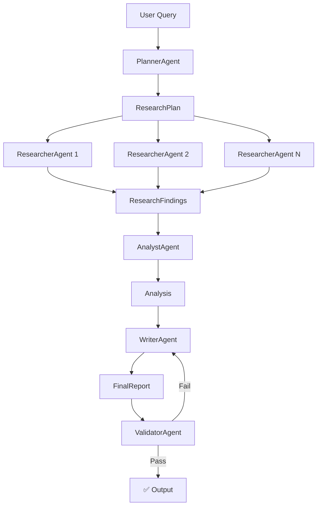

# AgentFlow 🔬

**Multi-agent research & analysis workflow** — a demo-ready pipeline where specialized agents plan, research, analyze, write, and validate reports using real external APIs.

## Architecture



## Features

- 🤖 **5 specialized agents** with a generic base class (DRY)
- 🔧 **5 tools** hitting real APIs (Wikipedia, GDELT News, Yahoo Finance, SEC EDGAR, Tavily)
- 📊 **Live event stream** for real-time progress tracking
- 🛡️ **Structured outputs** at every stage boundary (Pydantic v2)
- 🔄 **Graceful degradation** — partial failures don't crash the pipeline
- ✅ **Validation loop** — writer revises if validator finds issues
- 🧪 **Mock mode** — full demo runs offline without any API keys
- 💉 **Fault injection** — `--inject-failure news` demonstrates error handling

## Quick Start

### Prerequisites
- Python 3.11+
- (Optional) `ANTHROPIC_API_KEY` for live LLM calls

### Setup

```bash
cd agentflow
cp .env.example .env
# Edit .env with your API keys (or leave empty for mock mode)

pip install -e ".[dev]"
```

### Run (Mock Mode — No API Keys Needed)

```bash
python -m apps.cli "Company due-diligence brief on Acme Corp" --mock
```

### Run (Live Mode)

```bash
export ANTHROPIC_API_KEY=sk-ant-...
python -m apps.cli "Company due-diligence brief on Tesla"
```

### Streamlit Web Demo

```bash
streamlit run apps/streamlit_app.py
```

## Demo Scenarios

### 1. Happy Path
```bash
python -m apps.cli "Company due-diligence brief on Acme Corp" --mock
```
Full pipeline completes with a rendered report.

### 2. Injected Tool Failure
```bash
python -m apps.cli "Company due-diligence brief on Acme Corp" --mock --inject-failure news
```
Report is flagged as degraded but still completes.

### 3. Schema Repair
The mock client demonstrates the repair turn when an agent's first output fails validation.

## Project Structure

```
agentflow/
├── pyproject.toml
├── .env.example
├── src/agentflow/
│   ├── config.py              # pydantic-settings config
│   ├── resilience.py          # retry, timeouts, exceptions
│   ├── logging.py             # structured JSON logging
│   ├── pipeline.py            # orchestrator
│   ├── llm/
│   │   ├── __init__.py        # LLMClient protocol
│   │   ├── anthropic_client.py
│   │   └── mock_client.py
│   ├── models/
│   │   ├── plan.py            # ResearchPlan
│   │   ├── findings.py        # ResearchFindings
│   │   ├── analysis.py        # Analysis
│   │   ├── report.py          # FinalReport
│   │   ├── validation.py      # ValidationResult
│   │   ├── events.py          # PipelineEvent
│   │   └── results.py         # StageResult[T]
│   ├── tools/
│   │   ├── __init__.py        # Tool base + HTTP helper
│   │   ├── wikipedia.py
│   │   ├── news.py            # GDELT
│   │   ├── stocks.py          # yfinance
│   │   ├── sec.py             # SEC EDGAR
│   │   ├── web_search.py      # Tavily
│   │   └── registry.py
│   ├── agents/
│   │   ├── __init__.py        # Agent base class
│   │   ├── planner.py
│   │   ├── researcher.py
│   │   ├── analyst.py
│   │   ├── writer.py
│   │   └── validator.py
│   └── prompts/
│       ├── planner.md
│       ├── researcher.md
│       ├── analyst.md
│       ├── writer.md
│       └── validator.md
├── apps/
│   ├── cli.py                 # typer + rich CLI
│   └── streamlit_app.py       # Web demo
├── tests/
│   ├── unit/
│   │   ├── test_resilience.py
│   │   ├── test_tools.py
│   │   └── test_agents.py
│   └── integration/
│       └── test_pipeline.py
└── fixtures/
    └── __init__.py            # Recorded responses
```

## Extending

### Adding a New Tool (< 20 lines)

```python
# src/agentflow/tools/my_tool.py
from pydantic import BaseModel, Field
from agentflow.tools import Tool, ToolResult, http_get

class MyInput(BaseModel):
    query: str = Field(description="Search query")

class MyTool(Tool[MyInput]):
    name = "my_tool"
    description = "Does something useful"
    input_model = MyInput

    async def run(self, input: MyInput) -> ToolResult:
        resp = await http_get("https://api.example.com/search", params={"q": input.query})
        return ToolResult(content=resp.text[:4000])
```

Then register in `tools/registry.py`:
```python
from agentflow.tools.my_tool import MyTool
registry.register(MyTool())
```

### Adding a New Agent

```python
from agentflow.agents import Agent, load_prompt
from pydantic import BaseModel

class MyInput(BaseModel):
    data: str

class MyOutput(BaseModel):
    result: str

class MyAgent(Agent[MyInput, MyOutput]):
    def __init__(self, **kwargs):
        super().__init__(
            name="my_agent",
            system_prompt=load_prompt("my_agent"),
            input_model=MyInput,
            output_model=MyOutput,
            **kwargs,
        )
```

## Configuration

All settings via environment variables (see `.env.example`):

| Variable | Default | Description |
|----------|---------|-------------|
| `ANTHROPIC_API_KEY` | — | Anthropic API key |
| `ANTHROPIC_MODEL` | `claude-sonnet-4-20250514` | Model to use |
| `TAVILY_API_KEY` | — | Optional web search |
| `PIPELINE_STAGE_TIMEOUT_S` | `60` | Per-stage timeout |
| `PIPELINE_MAX_RESEARCH_TASKS` | `8` | Max research tasks |
| `PIPELINE_RESEARCH_CONCURRENCY` | `4` | Parallel researchers |
| `PIPELINE_MAX_AGENT_ITERATIONS` | `10` | Max tool-use loop iterations |
| `LOG_LEVEL` | `INFO` | Logging level |
| `LOG_FORMAT` | `json` | `json` or `text` |

## Development

```bash
# Install with dev dependencies
pip install -e ".[dev]"

# Run tests
pytest -q

# Type check
mypy src/

# Lint
ruff check src/ apps/

# Format
ruff format src/ apps/
```

## Design Decisions

1. **No frameworks** — Plain SDK + own orchestration for full control
2. **Generic Agent base** — One implementation, 5 agents, zero copy-paste
3. **Pydantic everywhere** — Every inter-stage contract is a validated model
4. **Event stream** — UI layers only consume events; core has zero UI imports
5. **Graceful degradation** — Failed research tasks don't crash; report discloses gaps
6. **Mock-first** — Full demo works offline; mock client scripts every LLM turn
